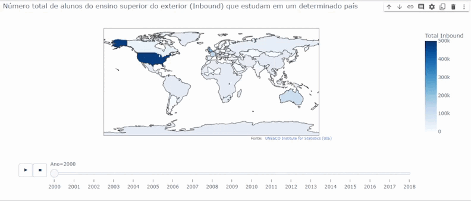
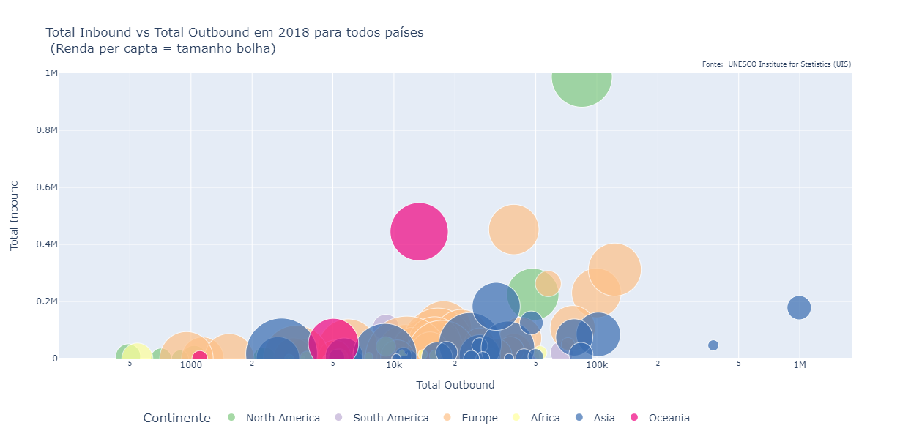

# Visão Analítica da Mobilidade Estudantil pelos dados do Instituto Unesco 
## Descrição do projeto
Projeto de visão analítica para observação da mobilidade estudantil, ensino superior do exterior (Inbound), no período de 2000 à 2018, utilizando tecnologias como Jupyter Notebook para programação em python, bibliotecas pandas e io para manipulação dos dados e plotly para geração e exibição dos gráficos interativos de mapas e o de bolhas para comparação dos métodos Inboud e Outbound.

## Funcionalidades do projeto

- `Funcionalidade 1`: Gerar um gráfico de map com o N=número total de alunos do ensino superior do exterior (Inbound) que estudam em um determinado país, do ano 2000 até 2018.
- `Funcionalidade 2`: Gerar um gráfico de dispersão (Bubble), com o total Inbound vs total Outbound em 2018 para todos países, tendo a renda per capta determinadno o tamanho bolha.

## Aplicação

## Ferramentas utilizadas
- `Jupyter Notebook`
- `Python`

## Acesso ao projeto

Você pode acessar o [código fonte do projeto](https://github.com/alan-vieira/mob_estudante_unesco/blob/main/unesco_mobilidade_estudantil.ipynb) ou [baixá-lo](https://github.com/alan-vieira/mob_estudante_unesco/archive/refs/heads/main.zip).

## Abrir e rodar o projeto
Após baixado, para o funcionamento correto da aplicação as seguintes dependêcias deverão ser instaladas.

- `Pandas`
- `IO`
- `Plotly`
- `emoji`

## Autor

| [ Alan Vieira](https://github.com/alan-vieira) |
| :---: |
